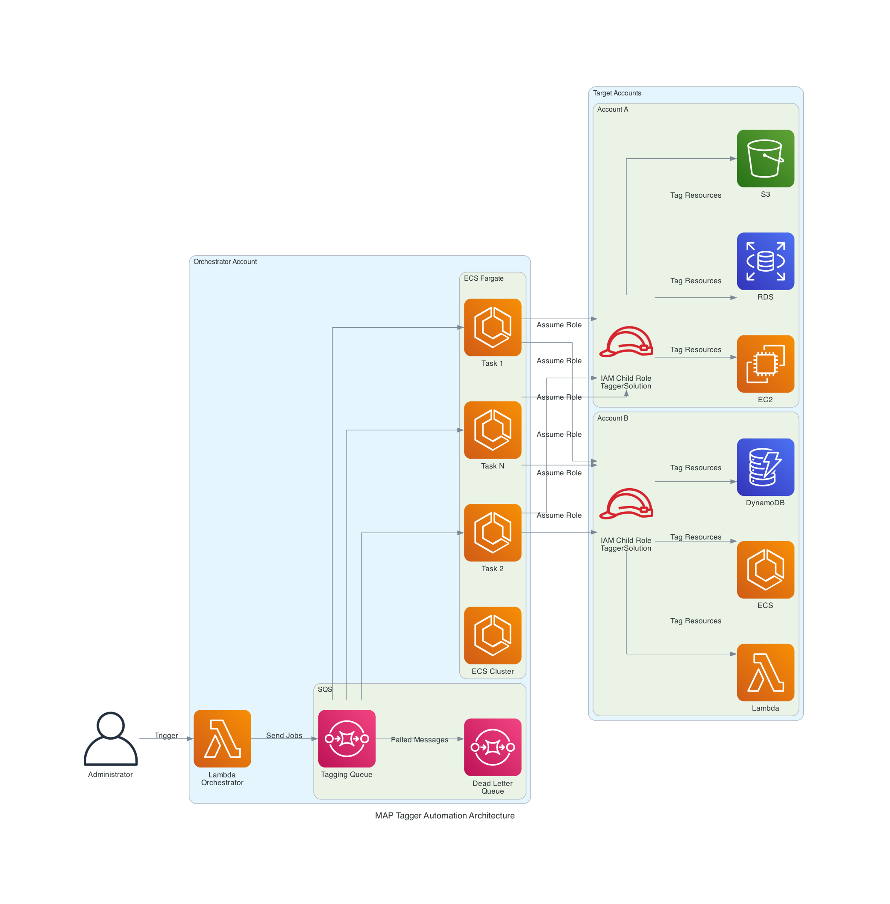

# MAP Resource Discovery & Tagging Engine

> **⚠️ Disclaimer:** This is sample code for non-production usage. You should work with your security and legal teams to meet your organizational security, regulatory, and compliance requirements before deployment. You are responsible for testing, securing, and optimizing this solution as appropriate for production use based on your specific quality control practices and standards. Deploying this solution may incur AWS charges for ECS, Lambda, SQS, CodeBuild, ECR, EventBridge, and CloudWatch. Under the [AWS Shared Responsibility Model](https://aws.amazon.com/compliance/shared-responsibility-model/), you are responsible for security decisions in the cloud, including the IAM roles and policies deployed by this solution.


## What is MAP Resource Discovery & Tagging Engine?

A boto3-based discovery engine that enumerates ALL existing AWS resources across 82 services and applies MAP 2.0 `map-migrated` tags. It provides a scalable, serverless approach to automatically tag AWS resources across multiple accounts and regions using ECS Fargate tasks orchestrated by Lambda functions.


## Key Features

- Cross-account and cross-region automated tagging
- Supports 82 AWS services out of the box
- Scalable ECS Fargate workers with SQS-based job distribution
- Configurable scheduling via EventBridge
- Date-based filtering to tag only resources created after a specific date


## Use Cases

- **MAP Migration Tracking:** Automatically apply `map-migrated` tags to all existing resources in accounts participating in the AWS Migration Acceleration Program.
- **Late MAP Enrollment:** Tag resources that were created before MAP enrollment or before CloudTrail's 90-day event history window.
- **Cost Attribution:** Ensure all resources are properly tagged for accurate cost allocation and migration credit tracking.
- **Compliance Audit:** Perform a full sweep of untagged resources across multiple accounts and regions.


## Architecture



```
EventBridge Schedule (or manual trigger)
    → Orchestrator Lambda
        → Sends 1 SQS message per account/region/service
            → ECS Fargate tasks (consume from SQS)
                → Load service module from modules/
                → Call discovery() to enumerate resources
                → Tag untagged resources with map-migrated
```

### Components

| File | Description |
|------|-------------|
| `cloudformation.map-tagger.yaml` | Main stack — ECS cluster, Lambda orchestrator, SQS queue, CodeBuild (builds Docker image), EventBridge schedule |
| `cloudformation.iam.role.yaml` | Cross-account IAM role for target accounts (deploy via StackSet) |
| `automation/lambda_orchestrator.py` | Fans out jobs to SQS — one message per account/region/service combo |
| `automation/ecs_map_tagger.py` | ECS worker — loads service modules, discovers resources, tags them |
| `automation/Dockerfile` | Container image — Python 3.9 + boto3 + modules |
| `modules/*.py` | 82 service-specific discovery and tagging modules |


## Solution Deployment

> **Time to deploy:** Approximately 10-15 minutes.

### Step 1: Deploy MAP Tagger Infrastructure (Central Account)

1. Download the CloudFormation template ([cloudformation.map-tagger.yaml](https://raw.githubusercontent.com/aws-samples/sample-tagger/refs/heads/main/cloudformation.map-tagger.yaml))

2. Sign in to the AWS Management Console
   - Navigate to the AWS Console (https://console.aws.amazon.com)
   - Sign in with your credentials

3. Navigate to the AWS CloudFormation service
   - From the AWS Console, search for "CloudFormation" in the search bar
   - Click on the CloudFormation service

4. Start Stack Creation
   - Click the "Create stack" button
   - Select "With new resources (standard)"

5. Specify Template Source
   - Choose "Upload a template file"
   - Click "Choose file" and select the `cloudformation.map-tagger.yaml` template
   - Click "Next"

6. Specify Stack Details
   - Enter a meaningful name for the stack (e.g., "map-tagger")

7. Configure Parameters

   **Network Configuration:**
   - **VpcId**: Select the VPC where ECS tasks will run
   - **SubnetIds**: Select private subnets with NAT gateway access for ECS tasks

   **Source Code:**
   - **GitHubRepo**: GitHub repository URL (default: https://github.com/aws-samples/sample-tagger.git)
   - **DockerfilePath**: Path to Dockerfile (default: automation/Dockerfile)

   **Tagging Configuration:**
   - **Accounts**: Comma-separated list of target AWS account IDs (e.g., 111111111111,222222222222)
   - **Regions**: Comma-separated list of AWS regions to process (default: us-east-1)
   - **StartDate**: Only tag resources created after this date in YYYY-MM-DD format (e.g., 2024-01-01)
   - **MapTagKey**: Tag key to apply (default: map-migrated)
   - **MapTagValue**: Tag value to apply (e.g., migXXXXXXXXXX)
   - **Services**: Comma-separated list of specific AWS services to tag, following naming convention in `modules/` (e.g., apigateway,dynamodb,ec2). Leave empty for all 82 supported services.

   **Scheduling (Optional):**
   - **ScheduleExpression**: EventBridge schedule expression (e.g., `rate(1 day)` or `cron(0 2 * * ? *)`)
   - **EnableSchedule**: Set to "true" to enable automatic scheduled execution (default: false)

8. Configure Stack Options (Optional)
   - Add any tags to help identify and manage your stack resources
   - Click "Next"

9. Review Stack Configuration
   - Review all the parameters and settings
   - Check the acknowledgment box: "I acknowledge that AWS CloudFormation might create IAM resources with custom names"
   - Click "Create stack"

10. Monitor Stack Creation
    - View the "Events" tab to monitor progress
    - Wait until the stack status changes to "CREATE_COMPLETE"

11. Note Stack Outputs
    - Navigate to the "Outputs" tab
    - Note the **ECSIAMRoleArn** value — you will need this for the next step


### Step 2: Deploy Cross-Account IAM Roles (Target Accounts)

To enable the MAP Tagger to access resources in target AWS accounts, deploy the IAM role as a CloudFormation StackSet from your management account.

1. Download the CloudFormation template ([cloudformation.iam.role.yaml](https://raw.githubusercontent.com/aws-samples/sample-tagger/refs/heads/main/cloudformation.iam.role.yaml))

2. Sign in to the AWS Management Console and navigate to CloudFormation

3. Click on **StackSets** on the left-side menu

4. Click **Create StackSet**

5. In the "Choose template" screen, select **Service-managed permissions**

6. Specify Template Source
   - Choose "Upload a template file"
   - Click "Choose file" and select the `cloudformation.iam.role.yaml` template
   - Click "Next"

7. Enter a name for the StackSet (e.g., "map-tagger-cross-account-role")

8. In the **RoleARN** parameter, enter the **ECSIAMRoleArn** value from the MAP Tagger stack outputs (from Step 1.11)

9. Click "Next"

10. In "Set deployment options", select **Deploy new stacks**

11. Under "Deployment targets", select the option that fits your deployment (organizational units or specific accounts)

12. Under "Specify regions", select **only one region** (e.g., US East - N. Virginia)
    > **Important:** Since this StackSet only deploys an IAM role (a global resource), selecting multiple regions will cause deployment errors.

13. Under "Deployment options", set **Failure tolerance** to **1**
    > **Important:** The StackSet will attempt to redeploy the existing role in the central account. If tolerance is not set to 1, the entire deployment will fail.

14. Review and verify all parameters

15. Check the acknowledgment box: "I acknowledge that AWS CloudFormation might create IAM resources with custom names"

16. Click **Submit**


### Step 3: Run the Tagger

**Manual Execution:**
- Navigate to Lambda in the AWS Console
- Find the `map-tagger-orchestrator` function
- Click "Test" to trigger a tagging run

**Scheduled Execution:**
- If you enabled the schedule during deployment, the orchestrator runs automatically
- To enable/disable: Update the stack and change the `EnableSchedule` parameter
- To modify the schedule: Update the `ScheduleExpression` parameter

### How It Works

1. The Lambda orchestrator creates one tagging job per account/region/service combination
2. Jobs are queued in SQS (with a dead-letter queue for failed messages)
3. ECS Fargate tasks are launched to process the queue
4. Each task assumes a cross-account IAM role and discovers + tags resources
5. Tasks automatically scale based on queue depth (configurable via `MAX_TASKS` and `MESSAGES_PER_TASK`)
6. Results are logged to CloudWatch Logs


## Supported Services (82 modules)

<details>
<summary>Click to expand full list</summary>

| Category | Services |
|----------|----------|
| Compute | ec2, ecs, eks, lambda, apprunner, elasticbeanstalk, emr |
| Database | rds, dynamodb, docdb, neptune, neptune-graph, elasticache, memorydb, redshift, redshift-serverless, timestream-write |
| Storage | s3, s3control, efs, fsx, glacier, ecr, backup |
| Networking | elb, elbv2, directconnect, route53, route53resolver, route53domains, route53profiles, route53-recovery-control-config, route53-recovery-readiness, network-firewall |
| AI/ML | bedrock, bedrock-agent, bedrock-data-automation, sagemaker, sagemaker-geospatial, comprehend, rekognition, textract, kendra, kendraranking, wisdom |
| Analytics | glue, databrew, athena, kafka, kafkaconnect, emr |
| Security | kms, secretsmanager, waf, waf-regional, wafv2, cloudhsm, cloudhsmv2, securityhub |
| Integration | sns, sqs, stepfunctions, apigateway, apigatewayv2 |
| Management | ssm, ssm-contacts, ssm-incidents, cloudfront, storagegateway, transfer, workspaces, ds, medical-imaging |
| Migration | mgn, drs, datasync |
| Other | connect, connectcampaigns, connectcampaignsv2, connectcases, datazone, cognito-idp, cognito-identity |

</details>


## Adding New Service Modules

Each module in `modules/` follows a standard interface. To add support for a new AWS service:

### Module Structure

Create `modules/<service-name>.py` with two required functions:

```python
def get_service_types(account_id, region, service, service_type):
    """Return a dict of resource type configs."""
    resource_configs = {
        'ResourceTypeName': {
            'method': 'list_things',        # boto3 method to enumerate resources
            'key': 'Things',                # response key containing the list
            'id_field': 'ThingId',          # field containing the resource identifier
            'date_field': 'CreatedAt',      # field with creation timestamp (or None)
            'nested': False,                # True if items are nested in sub-lists
            'arn_format': 'arn:aws:myservice:{region}:{account_id}:thing/{resource_id}'
        }
    }
    return resource_configs


def discovery(self, session, account_id, region, service, service_type, logger):
    """Enumerate resources and return them with tags."""
    status = "success"
    error_message = ""
    resources = []

    try:
        config = get_service_types(account_id, region, service, service_type)[service_type]
        client = session.client(service, region_name=region)

        paginator = client.get_paginator(config['method'])
        for page in paginator.paginate():
            for item in page[config['key']]:
                resource_id = item[config['id_field']]
                arn = config['arn_format'].format(
                    region=region, account_id=account_id, resource_id=resource_id
                )

                try:
                    tags_resp = client.list_tags_for_resource(ResourceArn=arn)
                    tags = {t['Key']: t['Value'] for t in tags_resp.get('Tags', [])}
                except Exception:
                    tags = {}

                resources.append({
                    "account_id": account_id,
                    "region": region,
                    "service": service,
                    "resource_type": service_type,
                    "resource_id": resource_id,
                    "name": tags.get('Name', resource_id),
                    "creation_date": str(item.get(config['date_field'], '')),
                    "tags": tags,
                    "tags_number": len(tags),
                    "arn": arn
                })
    except Exception as e:
        status = "error"
        error_message = str(e)
        logger.error(f"Discovery error: {error_message}")

    return f'{service}:{service_type}', status, error_message, resources
```

### Key Points

- The file name must match the boto3 service name (e.g., `opensearch.py` for `boto3.client('opensearch')`)
- `get_service_types()` can define multiple resource types per service (e.g., ec2.py defines Instance, Volume, Snapshot, VPC, etc.)
- The `discovery()` function must return a tuple: `(service_key, status, error_message, resources_list)`
- Each resource dict must include `arn` and `tags` — the ECS worker uses these to determine what needs tagging
- Handle pagination — most AWS list APIs are paginated
- Handle missing tags gracefully — not all resources have tags

### Testing a New Module

```python
import boto3
from modules import myservice

session = boto3.Session(region_name='us-east-1')
account_id = boto3.client('sts').get_caller_identity()['Account']

types = myservice.get_service_types(account_id, 'us-east-1', 'myservice', None)
for stype in types:
    key, status, err, resources = myservice.discovery(
        None, session, account_id, 'us-east-1', 'myservice', stype, logging.getLogger()
    )
    print(f"{key}: {len(resources)} resources found, status={status}")
```


## Security

See [CONTRIBUTING](CONTRIBUTING.md#security-issue-notifications) for more information.


## License

This library is licensed under the MIT-0 License. See the [LICENSE](LICENSE) file.
