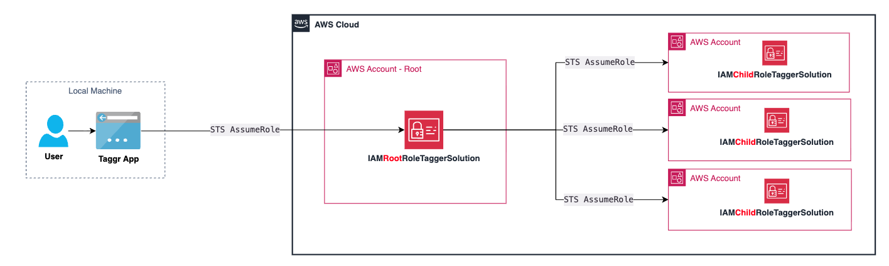
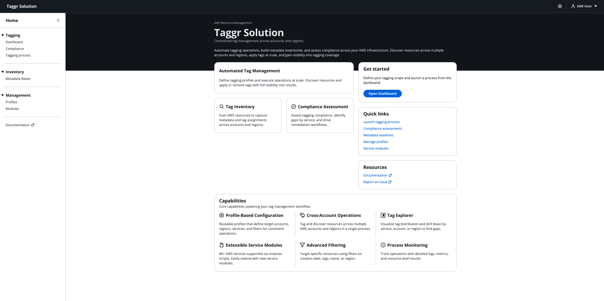
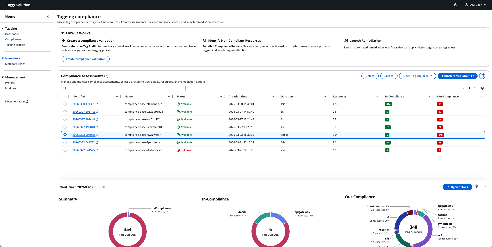
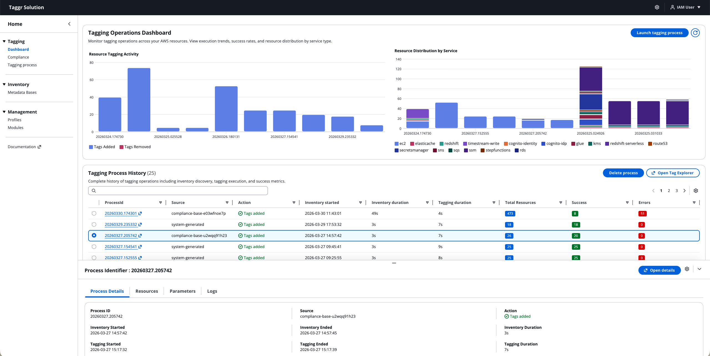
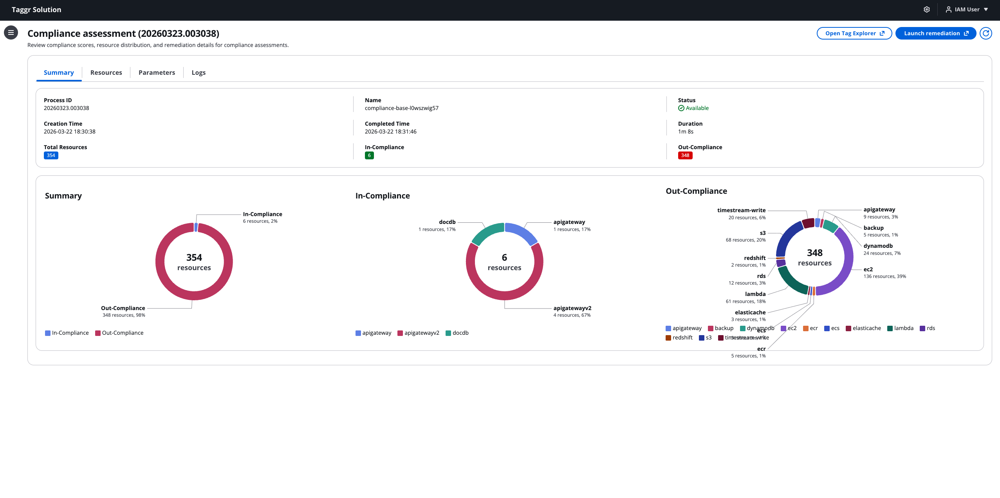
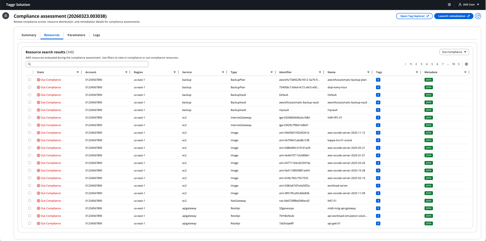
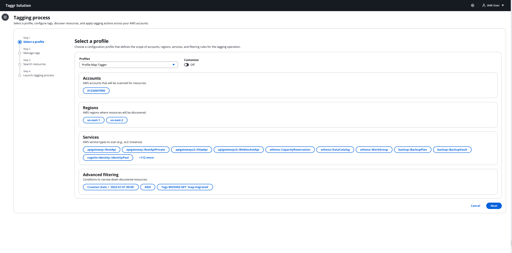
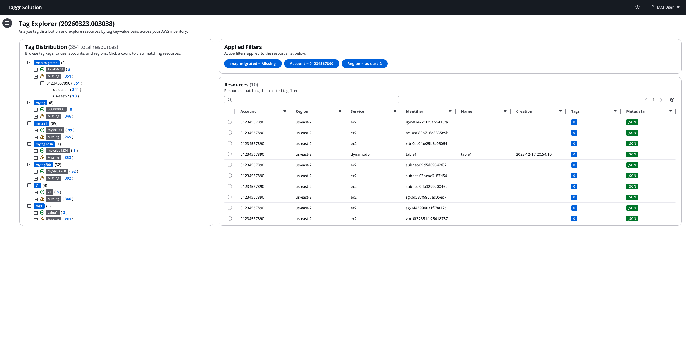

# Taggr Solution for AWS Services

Taggr Solution is a centralized AWS resource tagging, metadata inventory, and compliance management tool. It automates tagging operations across multiple accounts and regions, builds tag inventories for analysis, and assesses compliance against your organization's tagging standards.

> **Disclaimer:** This solution is AWS Content, as defined in the [Online Customer Agreement](https://aws.amazon.com/agreement/). You are responsible for testing, securing, and optimizing the AWS Content as appropriate for production use based on your specific quality control practices and standards. Deploying AWS Content may incur AWS charges for creating or using AWS chargeable resources.

## Key Features

- **Cross-Account Tagging** — Execute tagging operations across multiple AWS accounts and regions in a single process using a two-hop IAM role chain.
- **Tag Explorer** — Visualize tag key-value distribution across resources with drill-down by account and region.
- **Compliance Assessment** — Evaluate tagging compliance, identify gaps by service, and track in-compliance vs out-compliance resources.
- **Metadata Baselines** — Build tag inventory baselines by scanning resources, capturing metadata and tag assignments for analysis.
- **Advanced Filtering** — Target specific resources using filters on creation date, tags, name, or region.
- **80+ Service Modules** — Extensible Python modules for AWS service discovery and tagging, easily extended with new services.
- **Process Monitoring** — Track every operation with detailed logs, execution metrics, and resource-level results.

## Use Cases

- **Cost Allocation** — Automatically tag resources across departments for accurate cost attribution and budgeting.
- **Security Compliance** — Ensure all resources meet tagging standards for regulatory compliance, using filters to identify non-compliant resources.
- **Resource Optimization** — Use metadata search to locate resources across your AWS infrastructure and assess tagging coverage.

## Architecture

Taggr runs as a local FastAPI application that serves both the React frontend and the API backend on a single port. It uses SQLite for data storage and assumes IAM roles for cross-account AWS operations.





### IAM Role Chain

The solution uses a two-hop role assumption for cross-account access:

1. **Local IAM User** — Your AWS CLI credentials (user or role).
2. **IAMRootRoleTaggerSolution** — A role in your local account that your IAM user assumes. It has permission to assume child roles in other accounts.
3. **IAMChildRoleTaggerSolution** — A role deployed in each target account with permissions to discover and tag AWS resources.

This separation provides least-privilege access: the root role can only assume other roles, and the child role has the actual service permissions scoped to each target account.

## Deployment

> **Time to deploy:** Approximately 5 minutes.

### Prerequisites

- [AWS CLI](https://docs.aws.amazon.com/cli/latest/userguide/getting-started-install.html) installed and configured with valid credentials
- Python 3.11+ ([Windows installer](https://www.python.org/ftp/python/3.11.0/python-3.11.0b2-amd64.exe))

<details>
<summary><strong>AWS CLI Configuration Guide (Assume existing IAM roles)</strong></summary>

#### 1. Create an IAM User

Create an IAM user in your AWS account with permissions to assume the IAM roles created by CloudFormation:

1. Go to IAM → Users → Create user
2. Enter username (e.g., `taggr-user`)
3. Select "Attach policies directly"
4. Create and attach a custom policy with assume role permissions:
   ```json
   {
     "Version": "2012-10-17",
     "Statement": [
       {
         "Effect": "Allow",
         "Action": "sts:AssumeRole",
         "Resource": "*"
       }
     ]
   }
   ```
5. Complete user creation

#### 2. Create Access Keys

1. Go to IAM → Users → Select your user
2. Navigate to "Security credentials" tab
3. Click "Create access key"
4. Select "Command Line Interface (CLI)"
5. Check the confirmation box and click "Next"
6. Click "Create access key"
7. **Important:** Copy the Access Key ID and Secret Access Key

#### 3. Configure AWS CLI

**Using `aws configure`:**
```bash
aws configure
```

Enter your credentials:
```
AWS Access Key ID [None]: 
AWS Secret Access Key [None]: 
Default region name [None]: us-east-1
Default output format [None]: json
```

**Or using environment variables:**
```bash
# macOS / Linux
export AWS_ACCESS_KEY_ID=""
export AWS_SECRET_ACCESS_KEY=""
export AWS_DEFAULT_REGION="us-east-1"

# Windows (PowerShell)
$env:AWS_ACCESS_KEY_ID=""
$env:AWS_SECRET_ACCESS_KEY=""
$env:AWS_DEFAULT_REGION="us-east-1"
```

#### 4. Verify Configuration

```bash
aws sts get-caller-identity
```

Expected output:
```json
{
  "UserId": "",
  "Account": "123456789012",
  "Arn": "arn:aws:iam::123456789012:user/taggr-user"
}
```

</details>

<details>
<summary><strong>AWS CLI Configuration Guide (Create IAM roles from AWS CLI)</strong></summary>

#### 1. Create an IAM User

Create an IAM user in your AWS account with permissions to create IAM roles via CloudFormation:

1. Go to IAM → Users → Create user
2. Enter username (e.g., `taggr-admin`)
3. Select "Attach policies directly"
4. Attach the following AWS managed policy:
   - `IAMFullAccess` (for creating IAM roles)
   
   Or create a custom policy with minimum permissions:
   ```json
   {
     "Version": "2012-10-17",
     "Statement": [
       {
         "Effect": "Allow",
         "Action": [
           "iam:CreateRole",
           "iam:PutRolePolicy",
           "iam:AttachRolePolicy",
           "iam:GetRole",
           "iam:PassRole",
           "iam:DeleteRole",
           "iam:DetachRolePolicy",
           "iam:DeleteRolePolicy",
           "iam:ListAttachedRolePolicies",
           "iam:ListRolePolicies",
           "iam:CreatePolicy",
           "iam:GetPolicy",
           "iam:DeletePolicy",
           "iam:ListPolicyVersions",
           "cloudformation:CreateStack",
           "cloudformation:UpdateStack",
           "cloudformation:DeleteStack",
           "cloudformation:DescribeStacks",
           "cloudformation:DescribeStackEvents",
           "cloudformation:GetTemplate"
         ],
         "Resource": "*"
       }
     ]
   }
   ```
5. **Optional:** If you want to use the same user to assume the roles after creation, also attach this policy:
   ```json
   {
     "Version": "2012-10-17",
     "Statement": [
       {
         "Effect": "Allow",
         "Action": "sts:AssumeRole",
         "Resource": "*"
       }
     ]
   }
   ```
6. Complete user creation

#### 2. Create Access Keys

1. Go to IAM → Users → Select your user
2. Navigate to "Security credentials" tab
3. Click "Create access key"
4. Select "Command Line Interface (CLI)"
5. Check the confirmation box and click "Next"
6. Optionally add a description tag
7. Click "Create access key"
8. **Important:** Download the CSV or copy the Access Key ID and Secret Access Key (you won't be able to see the secret again)

#### 3. Configure AWS CLI

Set up your AWS CLI with the access keys:

**Using `aws configure` (Interactive):**
```bash
aws configure
```

You'll be prompted to enter:
```
AWS Access Key ID [None]: 
AWS Secret Access Key [None]: 
Default region name [None]: us-east-1
Default output format [None]: json
```

**Or using environment variables:**
```bash
# macOS / Linux
export AWS_ACCESS_KEY_ID=""
export AWS_SECRET_ACCESS_KEY=""
export AWS_DEFAULT_REGION="us-east-1"

# Windows (PowerShell)
$env:AWS_ACCESS_KEY_ID=""
$env:AWS_SECRET_ACCESS_KEY=""
$env:AWS_DEFAULT_REGION="us-east-1"

# Windows (Command Prompt)
set AWS_ACCESS_KEY_ID=""
set AWS_SECRET_ACCESS_KEY=""
set AWS_DEFAULT_REGION="us-east-1"
```

#### 4. Verify Configuration

Test your AWS CLI configuration:

```bash
# Verify credentials are working
aws sts get-caller-identity
```

Expected output:
```json
{
  "UserId": "",
  "Account": "123456789012",
  "Arn": "arn:aws:iam::123456789012:user/taggr-admin"
}
```

</details>


### Step 1: Clone the Repository

```bash
git clone https://github.com/aws-samples/sample-tagger.git
cd sample-tagger
```

### Step 2: Configure IAM Roles

Run the configuration script to validate your AWS setup and get the commands to create the required IAM roles:

**macOS / Linux:**
```bash
./configure.sh
```

**Windows (PowerShell):**
```powershell
.\configure.ps1
```

This will:
- Validate AWS CLI is installed and configured
- Detect your AWS account ID and IAM ARN
- Print the commands to create both IAM roles (CLI and Console options)

Example output:

```
=========================================
 Taggr Solution - Configuration Guide
=========================================

  Role chain for cross-account operations:

  Local IAM User
    └─► IAMRootRoleTaggerSolution (local account)
          └─► IAMChildRoleTaggerSolution (remote accounts)
```

```
─────────────────────────────────────────
Step 1: Validate AWS CLI & get identity
─────────────────────────────────────────

  ✓ AWS CLI found
  ✓ Account : 123456789012
  ✓ ARN     : arn:aws:iam::123456789012:user/myuser
```

```
─────────────────────────────────────────
Step 2: Create Root Role (local account)
─────────────────────────────────────────

  Option A - AWS CLI:

  aws cloudformation deploy \
    --template-file security/cloudformation.root.iam.role.yaml \
    --stack-name TaggrRootRole \
    --parameter-overrides PrincipalARN="arn:aws:iam::123456789012:user/myuser" \
    --capabilities CAPABILITY_NAMED_IAM

  Option B - AWS Console:

  1. Go to CloudFormation > Create stack > Upload a template file
  2. Upload: security/cloudformation.root.iam.role.yaml
  3. Stack name: TaggrRootRole
  4. Parameter PrincipalARN: arn:aws:iam::123456789012:user/myuser
  5. Check 'I acknowledge that AWS CloudFormation might create IAM resources'
  6. Create stack
```

```
─────────────────────────────────────────
Step 3: Create Child Role (target accounts)
─────────────────────────────────────────

  Option A - AWS CLI:

  aws cloudformation deploy \
    --template-file security/cloudformation.child.iam.role.yaml \
    --stack-name TaggrChildRole \
    --parameter-overrides RoleARN="arn:aws:iam::123456789012:role/IAMRootRoleTaggerSolution" \
    --capabilities CAPABILITY_NAMED_IAM

  Option B - AWS Console:

  1. Go to CloudFormation > Create stack > Upload a template file
  2. Upload: security/cloudformation.child.iam.role.yaml
  3. Stack name: TaggrChildRole
  4. Parameter RoleARN: arn:aws:iam::123456789012:role/IAMRootRoleTaggerSolution
  5. Check 'I acknowledge that AWS CloudFormation might create IAM resources'
  6. Create stack

  Run this in each target account where you want to tag resources.
```

```
─────────────────────────────────────────
Step 4: Run the application
─────────────────────────────────────────

  macOS / Linux:  ./start.sh
  Windows:        .\start.ps1

=========================================
```

For multi-account deployments, deploy the child role as a CloudFormation StackSet from your management account to roll it out across all target accounts.

### Step 3: Start the Application

**macOS / Linux:**
```bash
./start.sh
```

**Windows (PowerShell):**
```powershell
.\start.ps1
```

This will create a Python virtual environment, install dependencies, and start the FastAPI server on port 3000. Open [http://localhost:3000](http://localhost:3000) in your browser.

## Project Structure

```
sample-tagger/
├── api/                    # FastAPI backend
│   ├── api_core.py         # Main application + static file serving
│   ├── class_discovery.py  # Resource discovery engine
│   ├── class_tagger.py     # Tagging engine
│   ├── class_api_*.py      # API endpoint handlers
│   ├── modules/            # 80+ AWS service modules
│   └── build/              # React build output (served by FastAPI)
├── frontend/               # React application (Cloudscape UI)
├── security/               # CloudFormation templates for IAM roles
├── dbstore/                # SQLite database
├── config.json             # Application configuration
├── configure.sh            # IAM role setup guide (macOS/Linux)
├── configure.ps1           # IAM role setup guide (Windows)
├── start.sh                # Application startup script (macOS/Linux)
├── start.ps1               # Application startup script (Windows)
└── build.sh                # Build and package script
```

## Screenshots















## Security

See [CONTRIBUTING](CONTRIBUTING.md#security-issue-notifications) for more information.

## License

This library is licensed under the MIT-0 License. See the [LICENSE](LICENSE.txt) file.
